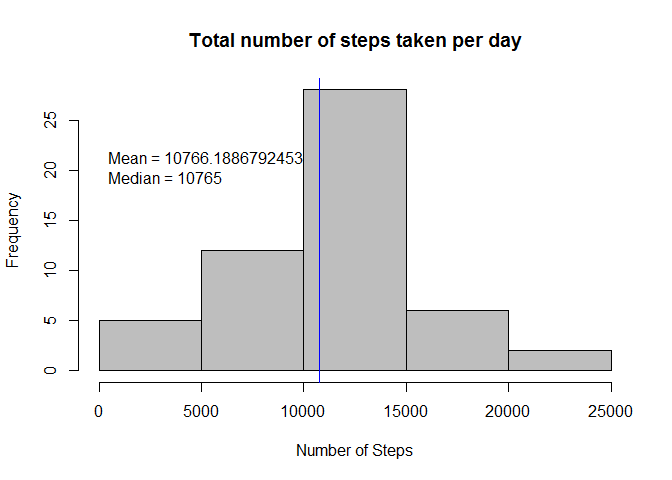

# assignment-1
henrique  
February 5, 2016  

###Step 1: Loading and preprocessing the data

Show any code that is needed to:
-- Load the data (i.e. read.csv())
-- Process/transform the data (if necessary) into a format suitable for your analysis


```r
  file_url <- "http://d396qusza40orc.cloudfront.net/repdata%2Fdata%2Factivity.zip"
  file_name <- paste(getwd(), "/data.zip", sep = "")
  file_dl <- download.file(file_url, file_name,mode="wb")
  unzip(file_name, list = FALSE, overwrite = TRUE)

  data <- read.csv("activity.csv")
```


###Step 2: What is mean total number of steps taken per day?

For this part of the assignment, you can ignore the missing values in the dataset.
-- Calculate the total number of steps taken per day
-- If you do not understand the difference between a histogram and a barplot, research the difference between them. Make a histogram of the total number of steps taken each day
-- Calculate and report the mean and median of the total number of steps taken per day


```r
  daysteps <- aggregate(steps ~ date, data, sum)
  hist(daysteps$steps, main = paste("Total number of steps taken per day"), col="gray", xlab="Number of Steps")
  daymean <- mean(daysteps$steps)
  daymedian <- median(daysteps$steps)
  abline(v = daymean, col = "blue", lwd = 1)
  text(20, paste("Mean =", daymean, "\nMedian =", daymedian),pos=4)
```

 


###Step 3: What is the average daily activity pattern?

-- Make a time series plot (i.e. type = "l") of the 5-minute interval (x-axis) and the average number of steps taken, averaged across all days (y-axis)
-- Which 5-minute interval, on average across all the days in the dataset, contains the maximum number of steps?


```r
  intervalsteps <- aggregate(steps ~ interval, data, mean)
  plot(intervalsteps$interval,intervalsteps$steps, type="l", xlab="5-minute interval", ylab="Number of Steps",main="Average number of steps taken")
  maxsteps <- intervalsteps[which.max(intervalsteps$steps),1]
  text(900, 150, paste("\n The 5-minute interval, on average","\n across all the days in the data set", "\n containing the maximum number", "\n of steps:", maxsteps),pos=4)
```

 


###Step 4: Imputing missing values

Note that there are a number of days/intervals where there are missing values (coded as NA). The presence of missing days may introduce bias into some calculations or summaries of the data.

-- Calculate and report the total number of missing values in the dataset (i.e. the total number of rows with NAs)

```r
  incomplete <- sum(!complete.cases(data))
  incomplete
```

```
## [1] 2304
```

-- Devise a strategy for filling in all of the missing values in the dataset. The strategy does not need to be sophisticated. For example, you could use the mean/median for that day, or the mean for that 5-minute interval, etc.

-- Create a new dataset that is equal to the original dataset but with the missing data filled in.

```r
  fillna <- transform(data, steps = ifelse(is.na(data$steps), intervalsteps$steps[match(data$interval, intervalsteps$interval)], data$steps))
  fillna[as.character(fillna$date) == "2012-10-01", 1] <- 0 #value for this day, since all were NAs
```

-- Make a histogram of the total number of steps taken each day


```r
  daysteps2 <- aggregate(steps ~ date, fillna, sum)
  hist(daysteps2$steps, main = paste("Total number of steps taken each day"), col="lightcyan3", xlab="Number of Steps")
  hist(daysteps$steps, main = paste("Total number of steps taken each day"), col="lightcyan4", xlab="Number of Steps", add=T)
legend("topright", c("Missing values imputed", "Without missing values"), col=c("lightcyan3", "lightcyan4"), lwd=10)
```

 

-- Calculate and report the mean and median total number of steps taken per day for missing values imputed data.


```r
  mean2 <- mean(daysteps2$steps)
  median2 <- median(daysteps2$steps)
  print(c("Mean total number of steps taken per day", mean2, "Median total number of steps taken per day", median2))
```

```
## [1] "Mean total number of steps taken per day"  
## [2] "10589.6937828642"                          
## [3] "Median total number of steps taken per day"
## [4] "10766.1886792453"
```

-- Difference between data with missing values imputed and non-imputed: Do these values differ from the estimates from the first part of the assignment?


```r
  meandif <- mean2 - daymean
  mediandif <- median2 - daymedian
  print(c("Mean difference between NA-imputed and non-imputed data", meandif, "Median difference between NA-imputed and non-imputed data", mediandif))
```

```
## [1] "Mean difference between NA-imputed and non-imputed data"  
## [2] "-176.494896381069"                                        
## [3] "Median difference between NA-imputed and non-imputed data"
## [4] "1.1886792452824"
```

-- Total steps difference between NA-imputed and non-imputed data: What is the impact of imputing missing data on the estimates of the total daily number of steps?


```r
  totaldif <- sum(daysteps2$steps) - sum(daysteps$steps)
  print(c("Mean difference between NA-imputed and non-imputed data", totaldif))
```

```
## [1] "Mean difference between NA-imputed and non-imputed data"
## [2] "75363.320754717"
```

###Step 5: Are there differences in activity patterns between weekdays and weekends?

For this part the weekdays() function may be of some help here. Use the dataset with the filled-in missing values for this part.
-- Create a new factor variable in the dataset with two levels weekday and weekend indicating whether a given date is a weekday or weekend day.
-- Make a panel plot containing a time series plot (i.e. type = "l") of the 5-minute interval (x-axis) and the average number of steps taken, averaged across all weekday days or weekend days (y-axis). See the README file in the GitHub repository to see an example of what this plot should look like using simulated data.


```r
week <- c("Monday", "Tuesday", "Wednesday", "Thursday", "Friday")

library(chron)
fillna$week = chron::is.weekend(fillna$date)
fillna$week = factor(fillna$week, levels=c(FALSE, TRUE), labels=c('weekday', 'weekend'))

intervalsteps <- aggregate(steps ~ interval + week, fillna, mean)

library(ggplot2)
  g <- ggplot(data=intervalsteps, aes(x=interval,y=steps))
  g + geom_line() + facet_grid(week~.) + labs(x="5-minute interval", y="Average number of steps taken",title="Average number of steps taken by Day:Interval")
```

 
  
